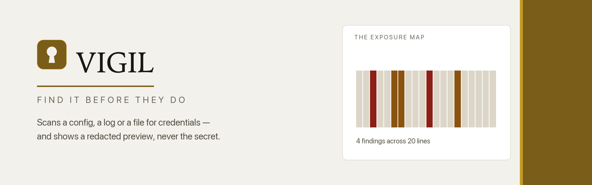
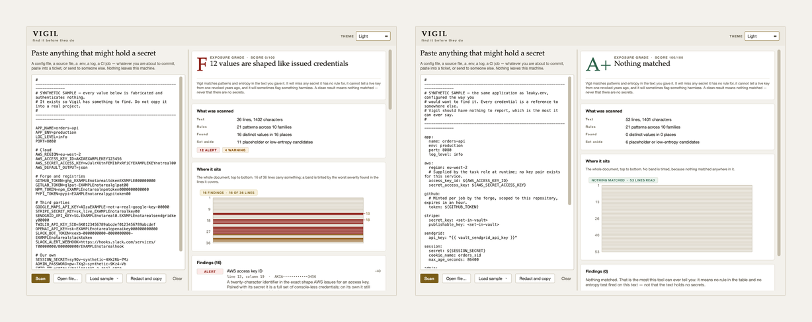

<div align="center">


<picture>
  <source media="(prefers-color-scheme: dark)" srcset="images/banner-dark.png">
  
</picture>

<br>

**An offline scanner for the credentials that end up in text — it names what it
recognises, shows a redacted preview instead of the value, draws where in the
document the exposure sits, and never says the text is clean.**

<br>


**[Vigil project site](https://at0m-b0mb.github.io/Vigil-Secret-Scanner/)**

</div>

---

## Why

Nobody publishes a secret on purpose. A key gets pasted into a file to get
something working, and then the file is committed, or attached to a ticket, or
dropped into a chat to ask a colleague what is wrong with it. The leak is the
paste. Everything after it is distribution.

Vigil is the look you take before the paste leaves your machine. Give it the
text — a config, a source file, a `.env`, a log, a CI job — and it reports every
value shaped like a credential, across **21 named patterns in 10 families**,
plus an entropy test for the ones nobody bothered to prefix.

A list tells you what; it is bad at telling you where. The **exposure map**
draws the whole document as a vertical strip, one band per slice of lines,
tinted by the worst thing found in it — nine keys packed into one pasted block
looks nothing like nine spread through a file, and a list reads identically in
both cases. Then **Redact and copy** puts the text on your clipboard with every
detected value replaced by a named placeholder, so you can send the config you
were going to send anyway.

<div align="center">
<picture>
  <source media="(prefers-color-scheme: dark)" srcset="images/screens-dark.png">
  
</picture>
<br>
<sub>A leaking <code>.env</code> (F) beside the same application configured properly (A+).</sub>
</div>

## The honest part

Vigil matches patterns and measures entropy in the text you gave it. That is
all it does, and the limits of it are printed on **every** result, including the
clean one.

**It will miss any secret it has no rule for** — a credential your company
mints, a format released next month, a key split across two lines. **It cannot
tell a live key from a revoked one**, because shape is the only evidence it has;
that is why it still reports the obviously fake `AKIAEXAMPLE…` keys in its own
samples, and why suppressing them would be the dishonest choice. And it will
sometimes flag something harmless — a long hex identifier can land in the shape
of a Twilio key SID, and the finding says so itself.

So **A+ means nothing matched, never that there are no secrets here.** The word
*safe* appears nowhere in a result: not in a headline, not in a finding, not in
the rule table. That is asserted as the word itself, swept across all 21 rules
and every rendered report, rather than as a list of phrases — because a list of
phrases is how the claim drifted out of true once already.

The ceiling shapes the whole scale. One finding of any kind costs the top grade:

| what the scan found | best possible grade |
|---|---|
| nothing | **A+** |
| a structural marker only — a certificate block | A |
| a soft exposure — a credential that cannot touch production | B |
| a real exposure — a bearer token, a password in a URL | C |
| anything shaped exactly like an issued credential | **F** |

The honest unknowns are capped rather than waved through. Text that does not
read as text — a binary, an archive, an encrypted blob — cannot be matched
against, so it is capped at **C** and labelled. Input that was never examined is
not capped but **ungraded**: it reads `—`, because a letter is a verdict and
there is nothing there to pass one on.

## Install

```bash
git clone https://github.com/at0m-b0mb/Vigil-Secret-Scanner.git
cd Vigil-Secret-Scanner
python3 -m pip install -r requirements.txt   # just PyQt6, for the window
```

The engine and the command line need nothing but the standard library. PyQt6 is
only for the window.

## Use

**The window:**

```bash
python3 -m vigil          # or:  python3 run.py
```

Paste the text and press **Scan**, open a file, or load one of the five bundled
samples; **Redact and copy** sits on the same row. **Light**, **Dark** and
**Auto** are top-right.

**The command line** — same engine, no Qt, pipe-friendly:

```bash
python3 -m vigil samples/leaky.env             # a readable report
cat samples/tidy-config.yml | python3 -m vigil -
python3 -m vigil samples/webhook_service.py --json
python3 -m vigil samples/leaky.env --redact > share.env
python3 -m vigil --list-rules                  # the 21 rules and what each costs
```

```
  F   11 values are shaped like issued credentials  (0/100)
Vigil matches patterns and entropy in the text you gave it. It will miss any
secret it has no rule for, it cannot tell a live key from one revoked years
ago, and it will sometimes flag something harmless. A clean result means
nothing matched — never that there are no secrets.

Scanned      36 lines, 1420 characters
Rules        21 patterns across 10 families
Found        15 distinct values in 15 places, touching 15 lines
Set aside    11 placeholder or low-entropy candidates

Findings (15)
  [ alert ] AWS access key ID -40
          line 13, col 19  ·  AKIA••••••••••••3456
          A twenty-character identifier in the exact shape AWS issues for an
          access key. Paired with its secret it is a full set of console-less
          credentials; on its own it still names the account and the key.
          What to do: Deactivate and delete this key in the AWS console under
          IAM → Users → Security credentials, issue a replacement, and read
          CloudTrail for use you did not make. Rotating the secret alone
          leaves this ID valid.
```

Never the value. A finding carries a redacted preview — at most four characters
from each end, fewer as the value shortens, none at all below nine characters —
plus offsets into the text you already have. There is no field a report, the
JSON, a screenshot or a log could print a secret from by accident. Identical
values collapse into one finding with a count, and the map still paints every
line.

**In CI or a pre-commit hook**, `--exit-code` turns a finding into a failure and
`--fail-on` chooses how loud it has to be:

```bash
python3 -m vigil samples/docker-compose.yml --exit-code --fail-on warning --no-color
```

Exit status is `2` when there was nothing to read, `1` when `--exit-code` is set
and something was found at or above the threshold, and `0` otherwise.

## What it checks

A rule either recognises an *issued* credential or it guesses, and Vigil treats
the two differently. A prefix is evidence: `AKIA` plus sixteen uppercase
characters, `ghp_` plus thirty-six, `AIza` plus thirty-five. Nothing else is
shaped that way by accident, so those rules apply no filter and no entropy
floor. A name is only a hint: `password = …` proves nothing about what follows,
so the generic rule judges the value and drops substitutions (`${VAR}`,
`{{ vault_key }}`, `<your-key-here>`, `%APPDATA%`), the placeholder vocabulary
(`changeme`, `redacted`, `your-api-key`), values that are not values, anything
repetitive, and anything below **3.0 bits of Shannon entropy per character**.
Everything dropped is counted and reported, so the judgement is visible rather
than silent.

| Family | What trips it | Worst it costs |
|---|---|---|
| **key-material** | a PEM private key block, claimed whole so its base64 body is never mined for coincidences | **F** |
| **cloud** | an AWS access key ID, a forty-character secret beside an AWS-named setting, a Google API key | **F** |
| **forge** | a GitHub token (`ghp_`, `ghs_`, `github_pat_`) or a GitLab personal access token | **F** |
| **registry** | an npm access token or a PyPI API token | **F** |
| **payments** | a Stripe live secret key — and, graded separately, a test key | **F** / notice |
| **saas** | a Slack token, SendGrid key, Twilio key SID, `sk-` model key — or a Slack incoming webhook | **F** / warning |
| **bearer** | a JWT, credentials in a URL's authority, a hard-coded `Authorization` header | C |
| **database** | a password written into a `postgres://`-style connection string | C |
| **assignment** | a secret-named value dense enough to be one — `private_key` and `ssh_key` included, bare `key` excluded so `cache_key` stays quiet | C |
| **structure** | a certificate block — the public half, reported so you know Vigil read it and chose not to count it | A |

The table is ordered so precedence works: a block claims its span first, the
generic rule runs last, and one value is reported once by the most specific rule
that saw it.

## Privacy

Vigil never touches the network. It opens no sockets, resolves no names and
sends nothing anywhere — the analysis is the standard library reading text you
already have. A test asserts that out of the import graph rather than in prose.

## Tests

```bash
python3 -m pip install -r requirements-dev.txt
python3 -m pytest -q
```

**783 test cases** across nine modules: the entropy and stand-in judgements,
every rule's positives *and* the near-misses it must refuse, precedence and
collapsing, the redactor, the grader's ceilings, the command line in all three
modes, and the window driven off-screen. Read that as cases rather than
scenarios — the contrast suite is 246 of them on its own, holding every
text/background pairing to **WCAG AA in both themes**, every ink on all five
grounds with no large-text exemption, and checking the built stylesheet as well
as the tokens.

Four assertions are the ones that matter. Nothing Vigil prints may contain a
secret from its input — checked against the real stdout, the real JSON and the
real widget tree. No headline may read as a clearance. The word *safe* may not
appear in a result at all. And a tinted band on the exposure map must cover the
line that caused it, walked line by line at six resolutions. That last one found
an off-by-one.

## Layout

```
vigil/
  core/            the engine — pure standard library, no Qt
    model.py         the dataclasses everything speaks in
    rules.py         21 named detectors, ordered so precedence works
    entropy.py       Shannon entropy, the stand-in filters, the redactor
    scan.py          text -> findings, with collapsing and the exposure bands
    grade.py         the letter, and the ceilings that hold it down
  ui/              the window
    theme.py         the design system: one place for every token
    exposuremap.py   the exposure map — Vigil's signature element
    widgets.py       cards, chips, key/value rows
    main_window.py   the scanner itself
  cli.py           the same engine on the command line
  app.py           the Qt entry point
  __main__.py      python3 -m vigil — the window, or the CLI if given arguments
run.py             the same window, without the -m
samples/           five synthetic files: leaky.env (F), webhook_service.py (F),
                   docker-compose.yml (C), release-notes.md (B),
                   tidy-config.yml (A+)
tests/             783 test cases in nine modules, including the contrast suite
tools/             brandkit.py and capture_screenshots.py
images/            marks, banners, screenshots, social card
```

Every value in the samples is fabricated — the vendor-shaped ones written
`AKIAEXAMPLE…` and `not-a-real-key`, the entropy-gated ones marked `synthetic`
because a value spelled `example` would be suppressed before it reached the rule
being demonstrated. None of them authenticates anything. Vigil reports them
anyway, which is the point.

## Colophon

Set in **Iowan Old Style** for identity and figures, the system **sans** for
anything you read, and a **mono** for the raw text and every redacted preview —
a serif/sans/mono mix that reads as authored rather than assembled. The palette
is warm paper and two golds: a deep brass (`#7A5D18`) legible as small text, and
a brighter shine used only on marks that carry no words. Dark mode is true black,
with nothing in the ramp that reads as blue. Every colour is declared as a
light/dark pair, and the contrast suite holds every pairing to WCAG AA so the
theme cannot quietly regress — the smallest role in the stylesheet is 11px and
it carries the honesty ceiling and every remediation.

The exposure map on the banner is not an illustration. The repository art
imports the engine and scans `samples/leaky.env`, so the picture on this page is
the one the application draws.

## License

MIT — see [LICENSE](LICENSE). For authorised, educational and personal use:
Vigil reads text you already have, and never sends it anywhere.
